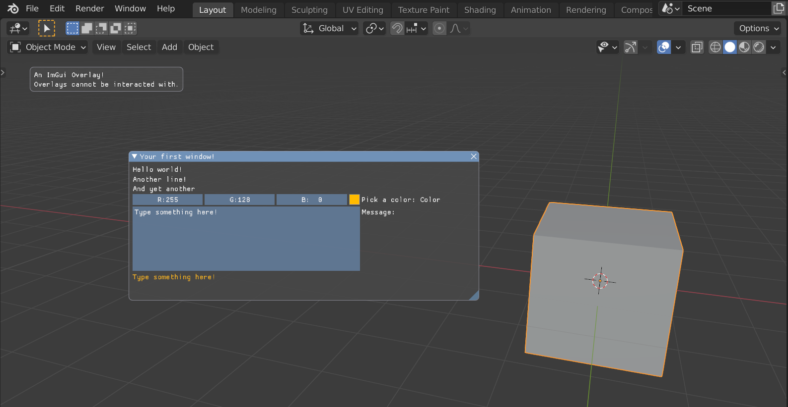
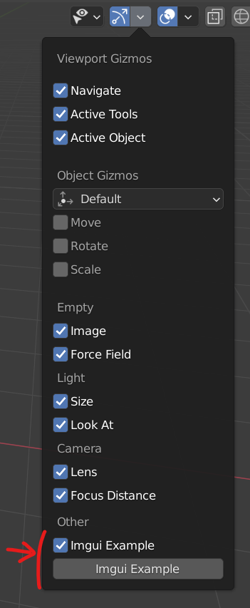

Dear Imgui for Blender
======================

Use the infamous [Dear ImGui](https://github.com/ocornut/imgui) library directly in your Blender scripts! This means custom GUI drawing in your operators:



Normally custom UI drawing in Blender is done using the binding of OpenGL from the [`bgl`](https://docs.blender.org/api/current/bgl.html) module as well as shader-related objects from the [`gpu`](https://docs.blender.org/api/current/gpu.html) module, but this is really low-level. [Dear ImGui](https://github.com/ocornut/imgui) is a now traditional tool used for quick debugging UIs that provides a **much more comfortable API**.

This repository provides backend code and examples to run Dear ImGui within Blender. This may be used for constant overlays or interactively during modal operators.

## Installation

Prior to using the code from this repository, we will install [Dear ImGui's Python binding](https://pyimgui.readthedocs.io/en/latest/). Beware that it must be installed **in Blender's Python**, not in system's Python so you must call `pip` through Blender's python like so:

```
REM An example on Windows
cd "C:\Program Files\Blender Foundation\Blender 2.91\2.91\python\bin"
.\python.exe -m pip install imgui
```

```
# An example on linux
cd /usr/lib/blender/2.91/python/bin
./python3.7m -m pip install imgui
```

If this fails, start over using a `cmd` in administrator mode. You may have to adapt the path after "cd".

## Examples

To quickly try out examples download ImguiExamples.zip from the [last release](https://github.com/eliemichel/BlenderImgui/releases/latest), don't unzip it and install it as an add-on.



To go further, hack on [operators.py](ImguiExample/operators.py) and [overlays.py](ImguiExample/overlays.py) and check out [pyimgui's documentation](https://pyimgui.readthedocs.io/en/latest)!

To embed this into your add-on, you just have to include [blender_imgui.py](blender_imgui.py) in your add-on's directory.

## License

This project has a whole is distributed under the terms of the GPLv3 license. See individual file's notices for more detailed licensing info.
